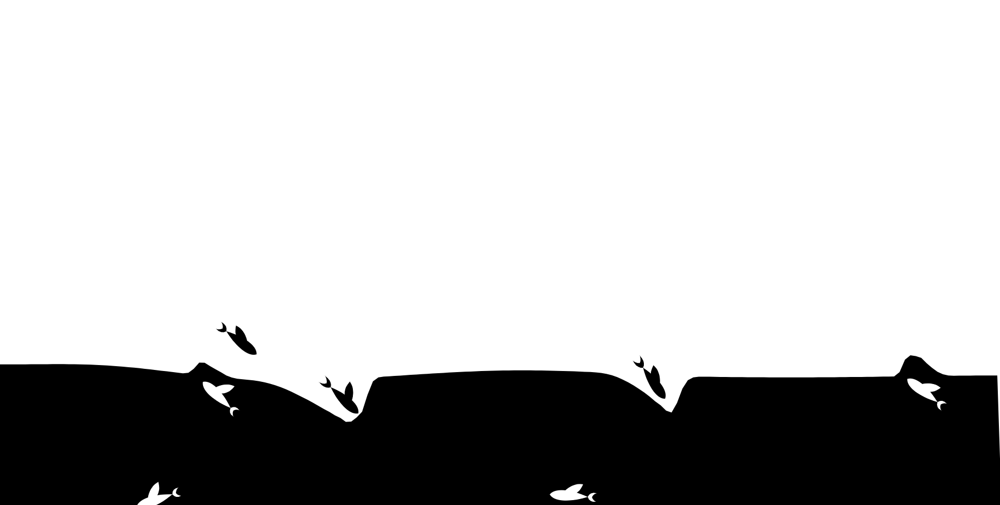

#                                           :fish: Fish-Animation

## :star2: Demo



##  :package: Install

​	You can simply get it by yarn or download the source code and build it by yourself.

```shell
# yarn
yarn add @forestlightelf/fish-animation
# build it your self(you shold know something about rollup and typescript)
rollup -c
```

## :book: Usage

```javascript
import {FishAnimation}from '@forestlightelf/fish-animation'
const App=(props)=>{
    return (
        <>
        <FishAnimation></FishAnimation>
        </>
    );
}
```

## :handshake: Contributing

​	If you love this project, thanks to buy me a coffee (or more likely a beer)!

